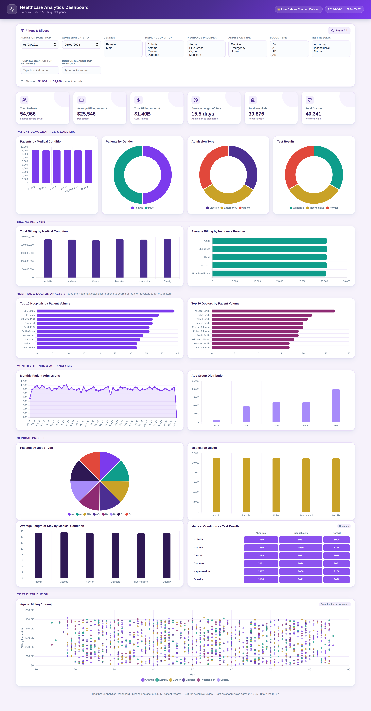
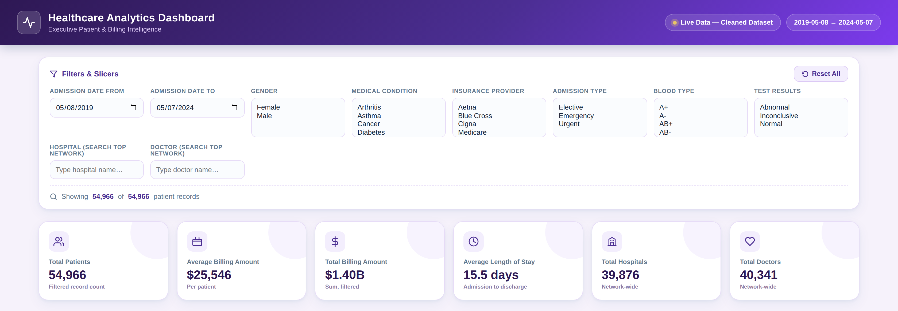
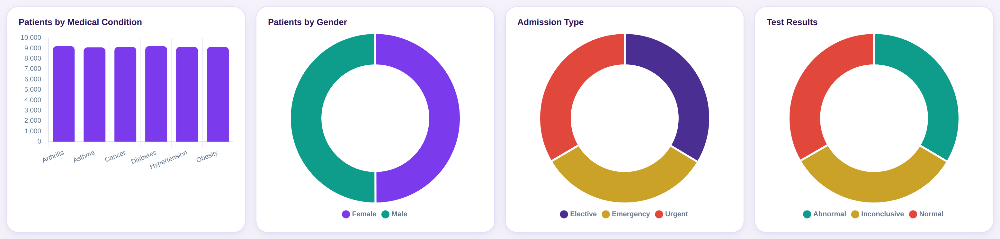
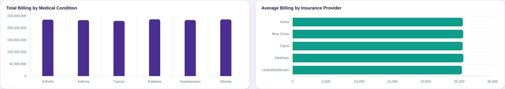
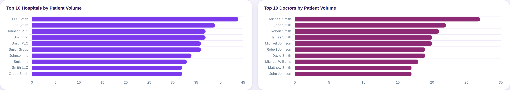
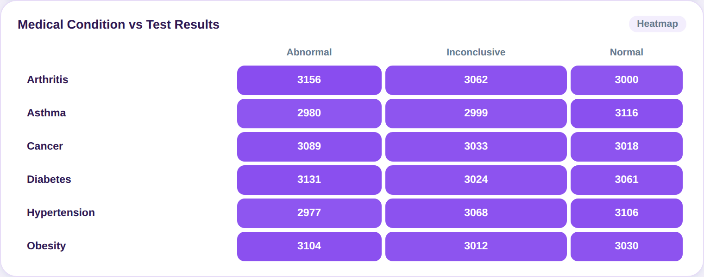
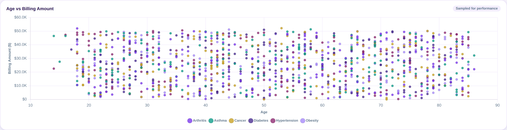

[README.md](https://github.com/user-attachments/files/29803390/README.md)
# 🏥 Healthcare Analytics Dashboard

An executive-level Healthcare Analytics Dashboard built from a raw 55,500-record patient dataset — covering data cleaning, KPI design, 15 visualizations, and 9 interactive slicers, styled with a premium purple & white theme for hospital and healthcare management reporting.



## 📋 Overview

This project takes a messy, real-world-style healthcare export and turns it into a polished, interactive analytics dashboard suitable for executive review. It includes:

- A full data-cleaning pipeline (Python/pandas)
- A cleaned, analysis-ready dataset (Excel, ready for Power BI import)
- An interactive, fully client-side HTML dashboard (no backend required)
- A complete Power BI build guide (DAX measures, chart configs, theme, layout)

## 📊 Dataset

| | |
|---|---|
| **Source records** | 55,500 |
| **Cleaned records** | 54,966 |
| **Date range** | May 2019 – May 2024 |
| **Columns** | Name, Age, Gender, Blood Type, Medical Condition, Date of Admission, Doctor, Hospital, Insurance Provider, Billing Amount, Room Number, Admission Type, Discharge Date, Medication, Test Results |

## 🧹 Data Cleaning

- Removed **534 duplicate rows**
- Parsed and validated `Date of Admission` / `Discharge Date` (caught & corrected any discharge-before-admission errors)
- Found and corrected **106 negative Billing Amount** values (converted to absolute value)
- Confirmed **zero missing values** across all columns
- Standardized text casing and trimmed whitespace on all text fields

## ⚙️ Calculated Columns

| Column | Logic |
|---|---|
| `Length of Stay` | Discharge Date − Date of Admission (days) |
| `Age Group` | Bucketed into 0-18 / 19-30 / 31-45 / 46-60 / 60+ |
| `Admission Month` | Month name from Date of Admission |
| `Admission Year` | Year from Date of Admission |

## 📈 KPIs

Total Patients · Average Billing Amount · Total Billing Amount · Average Length of Stay · Total Hospitals · Total Doctors



## 📊 Visualizations (15)

1. Patients by Medical Condition — Clustered Bar
2. Patients by Gender — Donut
3. Patients by Blood Type — Pie
4. Admission Type Distribution — Donut
5. Test Results Distribution — Donut
6. Monthly Patient Admissions — Line
7. Total Billing by Medical Condition — Column
8. Average Billing by Insurance Provider — Horizontal Bar
9. Top 10 Hospitals by Patient Volume — Bar
10. Top 10 Doctors by Patient Volume — Bar
11. Medication Usage — Bar
12. Average Length of Stay by Medical Condition — Column
13. Age Group Distribution — Column
14. Medical Condition vs Test Results — Heatmap
15. Age vs Billing Amount — Scatter Plot







## 🎛️ Slicers

Admission Date · Gender · Hospital (searchable, 39,876 unique) · Doctor (searchable, 40,341 unique) · Medical Condition · Insurance Provider · Admission Type · Blood Type · Test Results

All slicers cross-filter every KPI and chart on the page in real time.

## 🧮 DAX Measures (for Power BI)

```DAX
Total Patients   = DISTINCTCOUNT('Cleaned Data'[Name])
Total Billing    = SUM('Cleaned Data'[Billing Amount])
Average Billing  = AVERAGE('Cleaned Data'[Billing Amount])
Average Stay     = AVERAGE('Cleaned Data'[Length of Stay])
Patient Count    = COUNTROWS('Cleaned Data')
Total Admissions = COUNTROWS('Cleaned Data')
Total Hospitals  = DISTINCTCOUNT('Cleaned Data'[Hospital])
Total Doctors    = DISTINCTCOUNT('Cleaned Data'[Doctor])
```

## 🎨 Design

- Purple & white premium executive theme, rounded cards, soft shadows
- Blue & white variant also available (see `/screenshots` history or build guide)
- Responsive grid layout: KPI row → demographics → billing → hospital/doctor → trends → clinical profile → cost distribution
- Built with vanilla HTML/CSS/JS + Chart.js (fully self-contained, no server needed)

## 🗂️ Repository Contents

| File | Description |
|---|---|
| `healthcare_dashboard.html` | Live interactive dashboard — open directly in any browser |
| `Healthcare_Cleaned_Dataset.xlsx` | Cleaned dataset with calculated columns, ready for Power BI import |
| `PowerBI_Build_Guide.docx` | Full instructions to rebuild this dashboard natively in Power BI Desktop (DAX, chart configs, theme, drill-through, tooltips) |
| `screenshots/` | Dashboard screenshots for documentation/portfolio use |

## 🚀 How to Use

1. **View the dashboard**: download `healthcare_dashboard.html` and open it in any modern browser — no installation needed.
2. **Rebuild in Power BI**: import `Healthcare_Cleaned_Dataset.xlsx` into Power BI Desktop and follow `PowerBI_Build_Guide.docx` step by step.

## 🛠️ Tech Stack

`Python` (pandas) for data cleaning · `HTML/CSS/JavaScript` + `Chart.js` for the interactive dashboard · `Power BI / DAX` build guide for native BI deployment

## 📌 Notes

- Hospital and Doctor fields are near-unique per patient in this dataset (~1.4 patients per hospital on average), so "Top 10" rankings are relatively flat — a property of the source data rather than the dashboard logic.
- This is a portfolio/demonstration project built on a public-style synthetic healthcare dataset; no real patient data is used.

---

⭐ If you found this project useful, feel free to star the repo or connect with me on LinkedIn!
